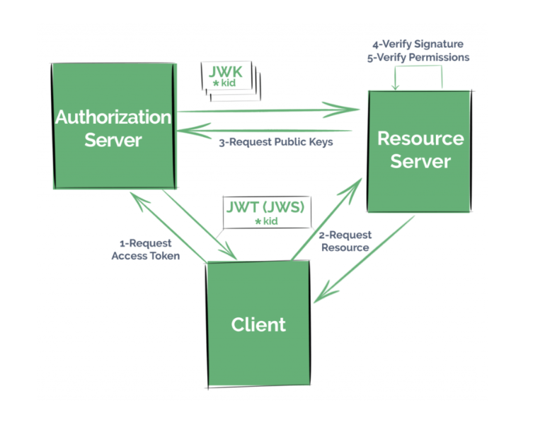
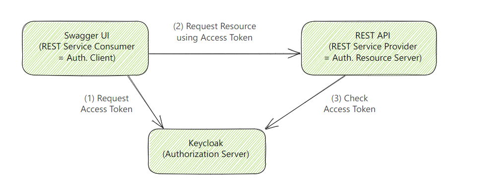

# 使用说明
_本项目在整个OAuth2.0 或 OpenID Connect中扮演的是一个 Resource Server角色_
### 基本原理

### Resource Server 配置
- 添加依赖：spring-boot-starter-oauth2-resource-server(加了这个依赖就不需要加spring security依赖)
- 添加一个spring security相关的配置类: 定义哪些资源(API)需要授权保护(一般如果没有特别细的权限要求，建议所有请求都需要认证)
```java
// Spring 5.7.x 中 WebSecurityConfigurerAdapter 类已经被废弃了，可以看该类注释说明
@Configuration
public class SecurityConfig {

    @Bean
    public SecurityFilterChain filterChain(HttpSecurity http) throws Exception {
        http.cors()
                .and()
                .authorizeRequests()
                .antMatchers(HttpMethod.GET, "/user/info", "/api/foos/**").hasAuthority("SCOPE_read")
                .antMatchers(HttpMethod.POST, "/api/foos").hasAuthority("SCOPE_write")
                .anyRequest()
                .authenticated()
                .and()
                .oauth2ResourceServer()//specifies that this is a resource server
                .jwt();
        return http.build();
    }
}
```
- 应用配置文件中指定授权服务器（keycloak）的相关信息(可以通过.well-known endpoint查看公开的endpoints)
```yaml
# 通过 http(s)://KeyCloakServerIP:PORT/realms/你的realm名称/.well-known/openid-configuration 
spring:
  security:
    oauth2:
      resourceserver:
        jwt:
          #issuer-uri: http://192.168.54.3:9090/realms/SpringBootKeycloak
          #jwk-set-uri: http://192.168.54.3:9090/realms/SpringBootKeycloak/protocol/openid-connect/certsissuer-uri: http://192.168.54.3:9090/realms/SpringBootKeycloak
          issuer-uri:  https://192.168.54.3:8844/realms/SpringBootKeycloak
          jwk-set-uri: https://192.168.54.3:8844/realms/SpringBootKeycloak/protocol/openid-connect/certs
```

## 证书相关
- 如果Keycloak开启了https，则 springboot项目即resource server中对证书处理方式可以是如下几种之一:
1. 信任所有证书，即直接信任服务端(keycloak)的证书：可以调用 SSLTool.java中类
2. 从服务器导出（或者访问浏览器然后导出）证书，然后导入到jvm的受信keystore中（JVM located at $JAVA_HOME\lib\security\cacerts）
```shell
keytool -import -noprompt -trustcacerts -alias <AliasName> -file   <certificate> -keystore <KeystoreFile> -storepass <Password>
```
3. 生成self-signed,使用三方工具进行证书自动化处理：mkcert(https://github.com/FiloSottile/mkcert),然后导入cacerts

### Use Case
- 安装一个 Keycloak 服务，作为 授权服务中心(即OAuth2.0 中的 Authorization Server)，
- 本项目测试时，keycloak版本为22.0.3 ,运行在 dev 模式(如果运行在 product 模式 可能需要更多与证书认证的配置)
- 准备一个客户端应用（e.g. vue , react , GUI 工具等 能发送http(https)请求即可）(OAuth Client App)
- 一个需要授权保护的应用（e.g. SpringBoot Appliction ）
- 通信过程如下图示意(此处使用swagger)


### keycloak 授权服务的配置
- 参考项目根目录下 setup/keycloak中说明

### 客户端应用如何获取AccessToken
- 参考项目根目录下 setup/ApiTester 目录下说明
