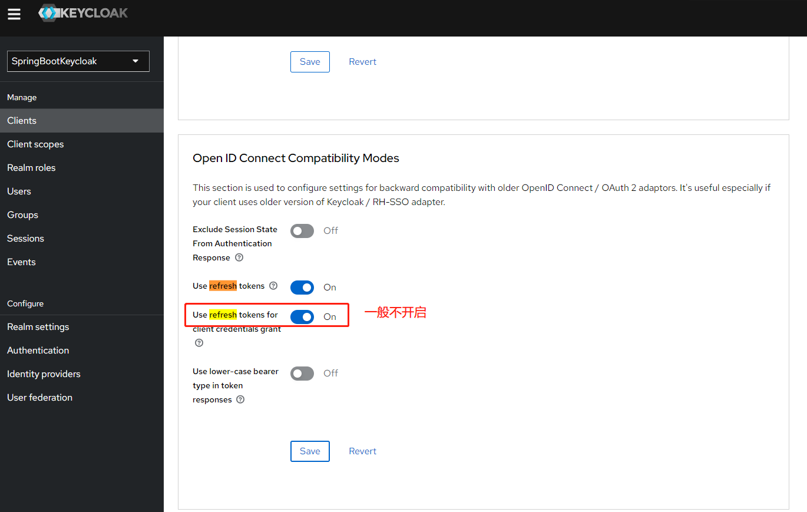

## Keycloak 配置
- 新建realm时 导入real-export.json: 生成一个名为 SpringBootKeycloak的realm
- 切换到 SpringBootKeycloak realm ， 在客户端菜单下导入login-app.json , 会生成一个login-app 的client

## Tips
- 生成的realm下的 token的 idle 及 lifespan 已经调整为 7 hours 
- realm下的 client_credentials 授权方式，开启了refresh_token(该授权方式下一般不建议开启)
